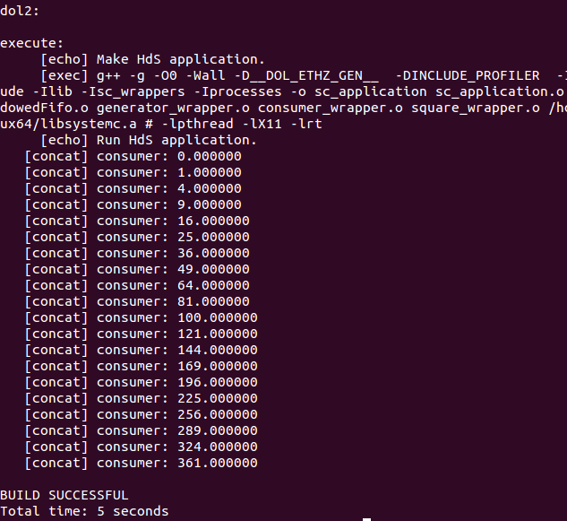

# DOL配置
-------------------


##Description

>**Distributed operation layer (DOL)** is a software development framework to program parallel applications. The DOL allows to specify applications based on the Kahn process network model of computation and features a simulation engine based on SystemC. Moreover, the DOL provides an XML-based specification format to describe the implementation of a parallel application on a multi-processor systems, including binding and mapping.

##How To Install


###安装必要环境

```bash
$ sudo apt-get update
$ sudo apt-get install ant
$ sudo apt-get install openjdk-7-jdk
$ sudo apt-get install unzip
```
### 下载文件

```bash
$ sudo wget http://www.accellera.org/images/downloads/standards/systemc/systemc-2.3.1.tgz
$ sudo wget http://www.tik.ee.ethz.ch/~shapes/downloads/dol_ethz.zip
```
### 解压文件
1. 新建dol的文件夹

   ```bash
   $ mkdir dol
   ```

2. 将dolethz.zip解压到 dol文件夹中

   ```bash
   $ unzip dol_ethz.zip -d dol
   ```
3. 解压systemc

   ```bash
   $ tar -zxvf systemc-2.3.1.tgz
   ```

### 编译systemc
1. 解压后进入systemc-2.3.1的目录下
   ```bash
   $ cd systemc-2.3.1
   ```

2. 新建一个临时文件夹objdir
   ```bash
   $ mkdir objdir
   ```
3. 进入该文件夹objdir
   ```bash
   $ cd objdir
   ```

4. 运行configure（能根据系统的环境设置一下参数，用于编译）
   ```bash
   $ ../configure CXX=g++ --disable-async-updates
   ```
   下图为运行configure之后的截图<br/>
   
5. 编译

   ```bash
   $ sudo make install
   ```

   编译完后文件目录如下(`$cd .. `      `$ls`)
   
6. 记录当前的工作路径（会输出当前所在路径，**记下来，待会有用**）

   ```bash
   $ pwd
   ```

### 编译dol
1. 进入刚刚的dol文件夹，修改build_zip.xml文件

   ```bash
   $ cd ~/dol
   $ sudo gedit build_zip.xml
   ```

   找到下面这段话，就是说上面编译的systemc位置在哪里

   > property name="systemc.inc" value="YYY/include"
   > property name="systemc.lib" value="YYY/lib-linux/libsystemc.a"/

   把YYY改成上页pwd的结果（**注意，对于  64位 系统的机器，把上面话中的lib-linux要改成lib-linux64，而且要将systemc-2.3.1目录下的lib-linux文件夹也重命名为lib-linux64**）

2. 编译
   ```bash
   $ ant -f build_zip.xml all
   ```

   若成功会显示build sucessful

   

3. 运行第一个例子<br/>
   进入build/bin/main路径下
   ```bash
   $ cd build/bin/main
   ```
   然后运行第一个例子
   ```bash
   $ ant -f runexample.xml -Dnumber=1
   ```
   成功结果如图所示

   


   很多人build成功，但是运行例子却不成功，可以去看看你的修改build_zip.xml文件那个YYY路径下，是否真的有那个文件，再进行适当修改


