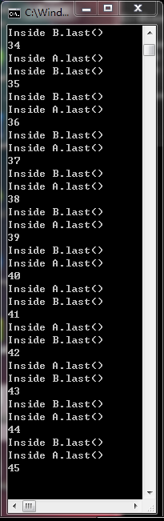

# Deadlock

## · 截图

## · 死锁产生的必要条件

> 1. 互斥条件：一个资源每次只能给一个进程使用 
> 2. 循环等待：系统中存在多个（大于2个）进程形成的封闭的进程链，链中的每个进程都在等待它的下一个进程所占有的资源
> 3. 不可抢占：资源申请者不能强行的从资源占有者手中夺取资源，资源只能由占有者自愿释放 
> 4. 占有并等待：已经得到某些资源的进程还可以申请其他新资源

## · 对上述程序产生死锁的解释

> 1. 互斥条件：由关键字synchronized实现，当用它来说修饰一个方法或者一个代码块的是偶，可以保证在同一时刻最多只有一个线程执行该段代码。l当一个线程访问object的一个synchronized同步代码块或同步方法时，其他线程对object中所有其它synchronized同步代码块或同步方法的访问将被阻塞。
> 2. 不可抢占：没有抢占机制
> 3. 请求和保持：在申请资源的同时，不会释放自己手中的资源
> 4. 循环等待 

### 产生死锁过程：

> 我们定义了两个独立的事务b.methodB(a)和事务a.methodB(b)，为了测试死锁，用while(count--)使事务执行产生延迟。可以知道如果执行b.methodB(a)的时候，占有了b.mthodB的资源，想要获取a.last的资源；执行a.methodB(b)的时候，占有了a.methodA的资源，想要获取b.last的资源。双方各自占有a或b，都想获取对方的a或b，同时结合上述的前提条件，故而产生死锁。

