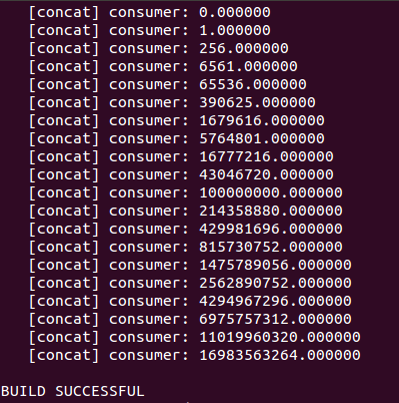
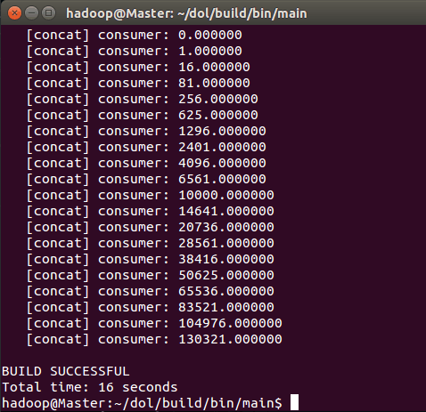
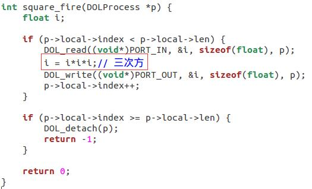
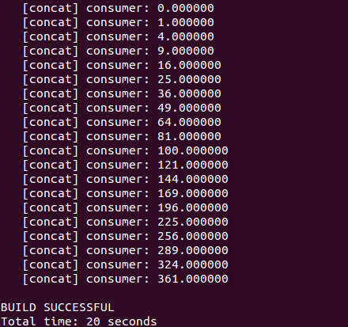
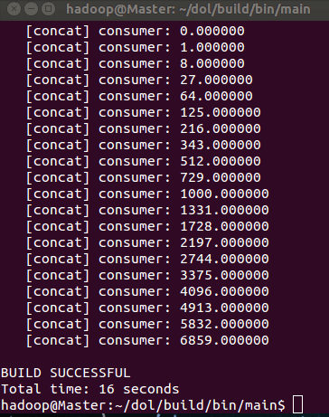

## Lab3-DOL实例分析编程


### 修改example2，让3个square模块变成2个


修改example1.xml如下,将N=3修改为N=2，这样后面的itertor中就会生成N个square，连接2个square：<br/>


 


 


 原运行结果如下：<br/>


 


 


 修改后如下：<br/>


 


 


dot截图如下：<br/>


### 修改example1，使其输出3次方数


修改square.c文件如下，改变其表达式从i^2到i^3：<br/>





原运行结果如下：<br/>





修改后如下：<br/>





dot截图如下：<br/>


### 实验感想


 1. 进程定义


	<process name=“未知数1">
	
			<port type=“未知数2” name=“未知数3”/>
	
			/*有几个端口就要有几行这个*/
	
			<port type=“未知数2” name=“未知数3”/>
	
			/*这里就是说有2个端口*/
	
			<source type=“c” location=“未知数1.c"/>
	
	</process>
	
	> 未知数1==实现的模块的名字，比如写了xxx.c这里就是xxx了
	
	> 未知数2==output或者input
	
	> 未知数3==端口的名字，在*.h的文件里面

​		

 2. 通道定义,一条线就是一条通道


    ``` xml
    <sw_channel type=“fifo” size=“未知数1” name=“未知数2">

    	<port type=“input” name=“in"/>
    	
    	<port type=“output” name=“out"/>
    	
    	/*两个端口，一个叫”in”，一个叫”out”*/
    	
    </sw_channel>
    ```


	> 未知数1是指缓冲区的大小，左边是10

	> 未知数2是这条线的名字，比如左边是C2

 3. 定义各个模块之间的连接


     > 一条线会对应两个connection，就是A框的右手牵着这条线的左边，这条线的右边牵着B框。！！每条线要有2个connection！！

    ``` xml
    <connection name=“未知数1">

       <origin name=“未知数2”> // !!从这!!

           <port name=“未知数3"/>

        </origin>

        <target name=“未知数4”> // !!连到这!!

    	 <port name=“未知数5"/>

         </target>

    </connection>
    ```

    > 未知数1是这段感情的名字，随便填。


    > 未知数2\未知数4是模块或者通道的名字


    > 未知数3\未知数5要对应process或者channel的端口名


​	


​	


