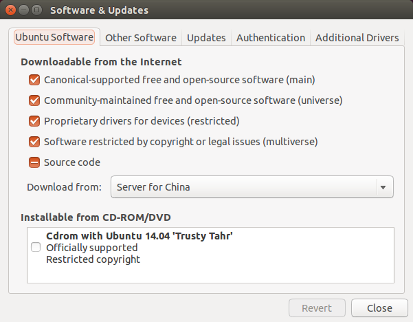

## Ubuntu14.04安装和配置ROS Indigo

### 安装ROS

#### 配置Ubuntu的软件源

配置Ubuntu要求允许接受restricted、universe和multiverse的软件源,可以根据下面的链接配置:

[https://help.ubuntu.com/community/Repositories/Ubuntu](https://help.ubuntu.com/community/Repositories/Ubuntu)

配置成如下图所示即可，一般情况下，这些配置都是默认的。 

### 添加软件源到sources.list

设置软件源的代码如下：

```shell
$ sudo sh -c 'echo "deb http://packages.ros.org/ros/ubuntu trusty main" > /etc/apt/sources.list.d/ros-latest.list'
```

一旦添加了正确的软件源，操作系统就知道去哪里下载程序，并根据命令自动安装软件。

### 设置密钥

```shell
$ wget http://packages.ros.org/ros.key -O - | sudo apt-key add -
```

### 安装

首先确认你的Debian的软件包索引是最新的。Debian计划是一个致力于创建一个自由操作系统的合作组织。我们所创建的这个操作系统名为 Debian。Debian系统目前采用Linux内核或者FreeBSD内核。

```shell
$ sudo apt-get update
```

在ROS中有许多不同的函数库和工具，建议是**完全安装**，也可以根据自己的要求分别安装。完全安装时的工具包括ROS、rqt、可视化环境rviz、通用机器人库robot-generic libraries、2D（如stage）和3D（如Gazebo）仿真环境2D/3D simulators、导航功能包集navigation and 2D/3D（移动、定位、地图绘制、机械臂控制）、感知库perception（如视觉、激光雷达、RGB-D摄像头等）。

```shell
$ sudo apt-get install ros-indigo-desktop-full
```

### 初始化rosdep

rosdep不仅能够使你更方便的安装一些系统依赖程序包，而且ROS的一些主要部件的运行也需要rosdep。

```shell
$ sudo rosdep init
$ rosdep update
```

### 安装rosinstall

rosinstall命令是一个使用的非常频繁的命令，使用这个命令可以轻松的下载许多ROS软件包。

```shell
$ sudo apt-get install python-rosinstall
```

### 设置环境

添加ROS的环境变量，这样，当你打开你新的shell时，你的bash会话中会自动添加环境变量。

```shell
$ echo "source /opt/ros/indigo/setup.bash" >> ~/.bashrc
# 使环境变量设置立即生效
$ source ~/.bashrc
```

### 配置你的ROS环境

注意：当你用像apt这样的软件包安装管理器安装ROS，那么这些软件包用户是没有权利的去编辑的，当创建一个ROS package和处理一个ROS package时，你应该始终选择一个你有权限工作的目录作为工作目录。

### 管理你的环境

在安装ROS的时候，你会看到提示：source（命令）几个setup.*sh文件，或者甚至添加sourcing到你的shell启动脚本中。这是必须的，因为ROS依赖于结合使用shell环境的概念上。这使得开发依赖不同版本的ROS或者不同系列的package更加容易。

如果你在寻找或者使用你的ROS package上有问题，请确定的你的ROS环境变量设置好了，检查是否有ROS_ROOT和ROS_PACKAGE_PATH这些环境变量。

```shell
$ export | grep ROS
```

如果没有，你需要source一些setup.*sh文件。

环境设置文件是为你产生的，但是可以来自不同的地方：

- 使用package管理器安装的ROS package提供setup.*sh文件；
- rosbuild workspace使用像rosws这样的工具提供setup.*sh文件；
- setup.*sh文件在编译和安装catkin package时作为副产品创建。

注意：rosbuild和catkin是两种组织和编译ROS代码的方式，前者简单易用，后者更加复杂但是提供更多灵活性尤其是对那些需要去集成外部代码或者想发布自己软件的人。

如果你在Ubuntu上使用apt工具安装ROS，那么你会在'/opt/ros/indigo/'目录中有setup.*sh文件，你可以这样source它们：

```shell
$ source /opt/ros/indigo/setup.bash
```

你每次打开新的shell都需要运行这个命令，如果你把source /opt/ros/indigo/setup.bash添加进.bashrc文件就不必要每次打开一个新的shell都运行这条命令才能使用ROS的命令了。

### 创建ROS工作环境

对于ROS Groovy和之后的版本可以参考以下方式建立catkin工作环境。在shell中运行：

```shell
$ mkdir -p ~/catkin_ws/src
$ cd ~/catkin_ws/src
$ catkin_init_workspace
```

可以看到在src文件夹中可以看到一个CMakeLists.txt的链接文件，即使这个工作空间是空的（在src中没有package），任然可以建立一个工作空间。

```shell
$ cd ~/catkin_ws/
$ catkin_make
```

catkin_make命令可以非常方便的建立一个catkin工作空间，在你的当前目录中可以看到有build和devel两个文件夹，在devel文件夹中可以看到许多个setup.*sh文件。启用这些文件都会覆盖你现在的环境变量，想了解更多，可以查看文档catkin。在继续下一步之前先启动你的新的setup.*sh 文件。

```shell
$ source devel/setup.bash
```

为了确认你的环境变量是否被setup脚本覆盖了，可以运行一下命令确认你的当前目录是否在环境变量中：

```shell
$ echo $ROS_PACKAGE_PATH
```

输出：

> ```
> /home/youruser/catkin_ws/src:/opt/ros/indigo/share:
> /opt/ros/indigo/stacks
> ```

至此，环境已经建立好了


