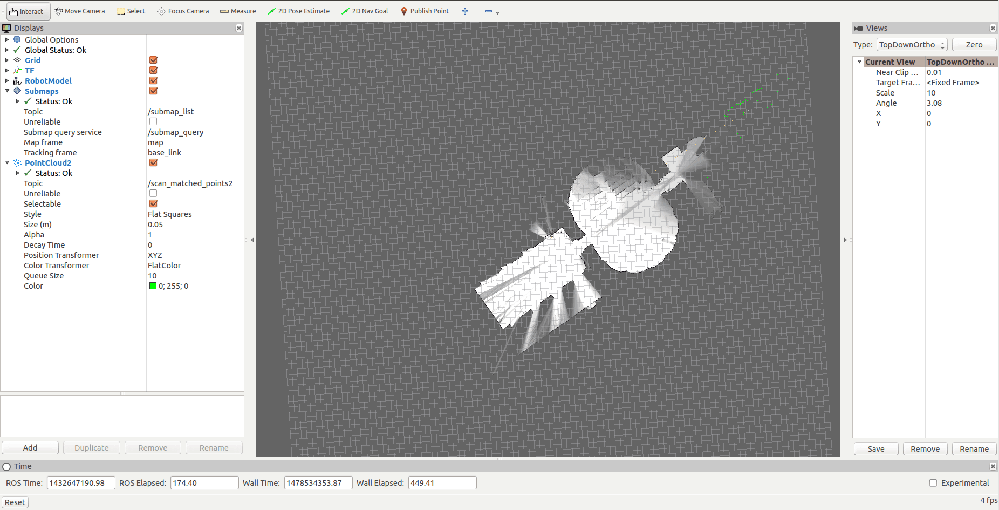

# cartographer配置

## 安装：

硬软件需求：

> 64位系统
> 16GB内存(本文8G貌似也行)
> Ubuntu 14.04 (Trusty)
> gcc version 4.8.4

Cartographer运行需要ubuntu 14.04(Trusty)下的Indigo版本ROS

1. 安装 wstool and rosdep

   ```bash
   sudo apt-get update
   sudo apt-get install -y python-wstool python-rosdep ninja-build
   ```

2. 创建新的工作空间:'catkin_ws'

   ```bash
   mkdir catkin_ws
   cd catkin_ws
   wstool init src
   ```

3. 合并cartographer_ros.rosinstall文件并或者代码的依赖

   ```bash
   wstool merge -t src https://raw.githubusercontent.com/googlecartographer/cartographer_ros/master/cartographer_ros.rosinstall
   wstool update -t src
   ```

4. 安装依赖

   ```shell
   rosdep update
   rosdep install --from-paths src --ignore-src --rosdistro=${ROS_DISTRO} -y
   ```

5. 安装

   ```shell
   catkin_make_isolated --install --use-ninja
   source install_isolated/setup.bash
   ```

   **备注：**

   问题：在catkin_make_isolated --install --use-ninja这一步，需要连接国外网下载[ceres-solver](http://blog.csdn.net/happiness_jia/article/details/52856197)，如果没有翻墙，会提示下载[ceres-solver](http://blog.csdn.net/happiness_jia/article/details/52856197)失败。

   解决方法：

   1. 购买个VPN，连上国外网，翻墙后再运行该步骤的命令

   2. 打开下面这个文件，修改[Git](http://lib.csdn.net/base/28)下载的地址

      build_isolated/ceres_solver/install/ceres_src-prefix/tmp/ceres_src-gitclone.cmake

      粗体url地址部分修改成如下这样：

      > while(error_codeAND number_of_tries LESS 3)
      >
      > execute_process(
      >
      > COMMAND "/usr/bin/git" clone "**https://github.com/ceres-solver/ceres-solver**" "ceres_src"
      >
      > WORKING_DIRECTORY

      修改好后从新运行该步骤命令

## 运行demo

- 下载2D示例包

  ```shell
  wget -P ~/Downloads https://storage.googleapis.com/cartographer-public-data/bags/backpack_2d/cartographer_paper_deutsches_museum.bag
  ```


- 启动测试2D示例

  ```shell
   roslaunch cartographer_ros demo_backpack_2d.launch bag_filename:=${HOME}/Downloads/cartographer_paper_deutsches_museum.bag
  ```


- 结果如图所示

  

   

   ​
